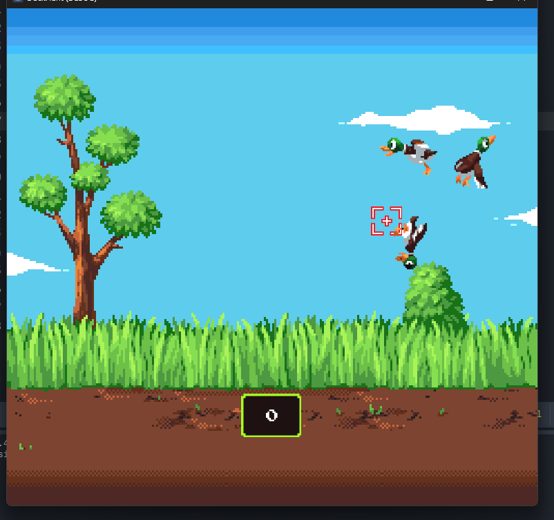
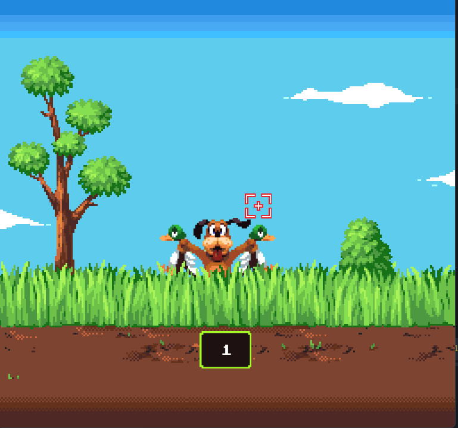

# Duck Hunt Clone 🦆🎯

Um pequeno jogo feito na Godot, inspirado no clássico Duck Hunt da Nintendo.

## Imagem do Jogo

  
  

## Como Jogar

- Use o mouse para mover a mira.
- Clique (ou pressione a tecla configurada para "atirar") para disparar nos patos.
- Cada pato abatido conta como capturado.
- Se os patos escaparem, o cachorro irá rir de você 😅

## Funcionalidades

- Geração aleatória de patos na tela.
- Áudio e animações para captura ou fuga.
- Sistema de pontuação.
- Animações de morte para os patos.

## Requisitos

- Godot Engine 4.x

## Executando

1. Abra o projeto no Godot.
2. Execute a cena principal (`Main.tscn` ou similar).

---

Divirta-se caçando patos! 🎮🦆
